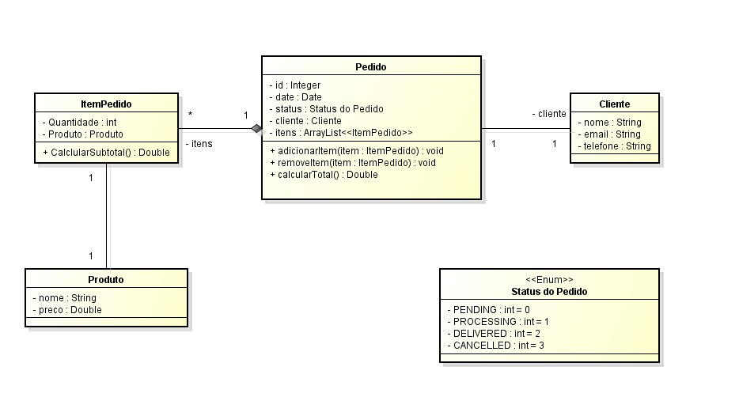

# 🛒 Sistema de Pedidos  

## 📌 Descrição do Projeto  
Este sistema gerencia pedidos de clientes, com controle de produtos, itens do pedido e status da entrega.  

---

## 📊 Diagrama UML  
  

---

## 📂 Estrutura do Projeto  

### 🔹 Classes Principais  

#### 1. *Pedido*  
- Representa um pedido realizado por um cliente.  
- *Atributos*:
  - 🆔 id: Identificador do pedido.  
  - 📅 date: Data do pedido.  
  - 📦 status: Status atual do pedido.  
  - 👤 cliente: Cliente que realizou o pedido.  
  - 📋 itens: Lista de itens do pedido.  
- *Métodos*:
  - adicionarItem(ItemPedido item): Adiciona um item ao pedido.  
  - removerItem(ItemPedido item): Remove um item do pedido.  
  - calcularTotal(): Calcula o valor total do pedido.  

#### 2. *ItemPedido*  
- Representa um item dentro de um pedido.  
- *Atributos*:
  - 🔢 quantidade: Quantidade do produto.  
  - 📦 produto: Produto associado ao item.  
- *Métodos*:
  - calcularSubtotal(): Retorna o valor subtotal do item (preço * quantidade).  

#### 3. *Produto*  
- Representa um produto disponível para venda.  
- *Atributos*:
  - 🏷 nome: Nome do produto.  
  - 💲 preco: Preço unitário do produto.  

#### 4. *Cliente*  
- Representa o cliente que faz o pedido.  
- *Atributos*:
  - 🧑 nome: Nome do cliente.  
  - 📧 email: E-mail do cliente.  
  - 📞 telefone: Telefone do cliente.  

#### 5. *Status do Pedido (Enum)*  
- Define os possíveis estados de um pedido:  
  - ⏳ PENDING = 0 (Pendente)  
  - 🔄 PROCESSING = 1 (Em processamento)  
  - 📬 DELIVERED = 2 (Entregue)  
  - ❌ CANCELLED = 3 (Cancelado)  

---

## 🚀 Funcionalidades  
✅ Registrar novos pedidos com cliente e itens.  
✅ Adicionar e remover produtos de um pedido.  
✅ Calcular subtotal por item e total geral.  
✅ Atualizar o status de um pedido.  

---

## ⚙ Tecnologias Utilizadas  
- ☕ *Java 17+*  
- 🔹 *POO (Programação Orientada a Objetos)*  
- 📂 *Coleções Java (ArrayList)*  
- 🏷 *Enums para status*  

---

## ▶ Como Executar  
1. Clone o repositório:  
   ```bash
   git clone https://github.com/Artur14seni/Exerciciocomposicao-Java3.git
